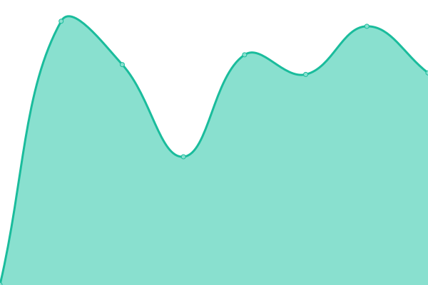

# [📈 Live Status](https://upptime.cicorella.net): <!--live status--> **🟧 Partial outage**

This repository contains the open-source uptime monitor and status page for [titouan-joseph](https://upptime.cicorella.net), powered by [Upptime](https://github.com/upptime/upptime).

With [Upptime](https://upptime.js.org), you can get your own unlimited and free uptime monitor and status page, powered entirely by a GitHub repository. We use [Issues](https://github.com/titouan-joseph/upptime/issues) as incident reports, [Actions](https://github.com/titouan-joseph/upptime/actions) as uptime monitors, and [Pages](https://upptime.cicorella.net) for the status page.

<!--start: status pages-->
<!-- This summary is generated by Upptime (https://github.com/upptime/upptime) -->
<!-- Do not edit this manually, your changes will be overwritten -->
<!-- prettier-ignore -->
| URL | Status | History | Response Time | Uptime |
| --- | ------ | ------- | ------------- | ------ |
|  [Google](https://www.google.com) | 🟩 Up | [google.yml](https://github.com/titouan-joseph/upptime/commits/HEAD/history/google.yml) | 

 346ms
     
 | 

<a href="https://upptime.cicorella.net/history/google">100.00%</a>
    

|  [Portfolio](https://titouan-joseph.cicorella.net) | 🟥 Down | [portfolio.yml](https://github.com/titouan-joseph/upptime/commits/HEAD/history/portfolio.yml) | 

 0ms
     
 | 

<a href="https://upptime.cicorella.net/history/portfolio">0.00%</a>
    

|  [NAS](https://nas.cicorella.net) | 🟩 Up | [nas.yml](https://github.com/titouan-joseph/upptime/commits/HEAD/history/nas.yml) | 

 1046ms
     
 | 

<a href="https://upptime.cicorella.net/history/nas">100.00%</a>
    

|  [neonlink](https://neonlink.cluster.cicorella.net) | 🟥 Down | [neonlink.yml](https://github.com/titouan-joseph/upptime/commits/HEAD/history/neonlink.yml) | 

 0ms
     
 | 

<a href="https://upptime.cicorella.net/history/neonlink">0.00%</a>
    

|  [nodered](https://nodered.cluster.cicorella.net) | 🟥 Down | [nodered.yml](https://github.com/titouan-joseph/upptime/commits/HEAD/history/nodered.yml) | 

 0ms
     
 | 

<a href="https://upptime.cicorella.net/history/nodered">0.00%</a>
    

<!--end: status pages-->

[**Visit our status website →**](https://upptime.cicorella.net)

## 📄 License

- Powered by: [Upptime](https://github.com/upptime/upptime)
- Code: [MIT](./LICENSE) © [titouan-joseph](https://upptime.cicorella.net)
- Data in the `./history` directory: [Open Database License](https://opendatacommons.org/licenses/odbl/1-0/)
